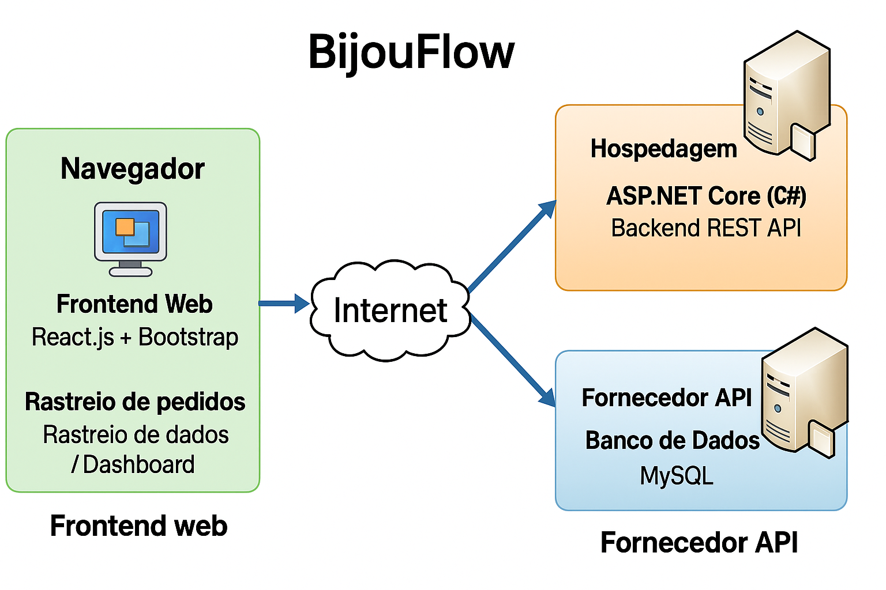
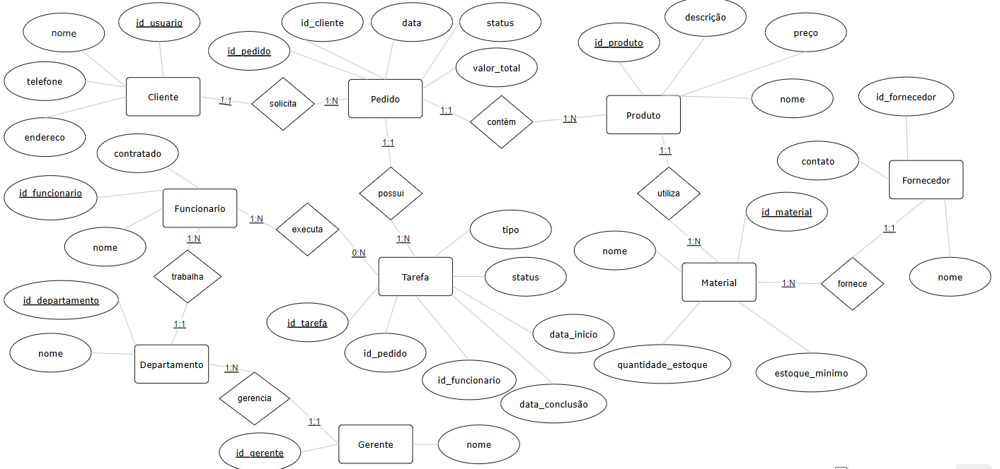

## 4. Projeto da Solução

Pré-requisitos: <a href="03-Modelagem do Processo de Negocio.md"> Modelagem do Processo de Negocio</a>

## 4.1. Arquitetura da solução

O BijouFlow é uma solução integrada para gestão de pedidos e produção da LuxeBijoux, composta por 4 módulos principais que se comunicam para automatizar processos manuais, garantir rastreabilidade e melhorar a eficiência operacional.

## Módulos e Tecnologias

**Módulo	Tecnologias	Função Principal**

-> Frontend Web	: React.js, Bootstrap	Interface para clientes (rastreio de pedidos) e gerentes (dashboard de produção)

-> Backend	ASP.NET Core (C#) : REST API	Lógica de negócio, integrações e processamento de dados

-> Banco de Dados	MySQL	: Armazenamento de pedidos, tarefas, estoque e histórico

 Inclua um diagrama da solução e descreva os módulos e as tecnologias
 que fazem parte da solução. Discorra sobre o diagrama.
 
 **Exemplo do diagrama de Arquitetura**:
 
 
 

### 4.2. Protótipos de telas

Visão geral da interação do usuário pelas telas do sistema e protótipo interativo das telas com as funcionalidades que fazem parte do sistema (wireframes).
Apresente as principais interfaces da plataforma. Discuta como ela foi elaborada de forma a atender os requisitos funcionais, não funcionais e histórias de usuário abordados nas <a href="02-Especificação do Projeto.md"> Especificação do Projeto</a>.
A partir das atividades de usuário identificadas na seção anterior, elabore o protótipo de tela de cada uma delas.

São protótipos usados em design de interface para sugerir a estrutura de um site web e seu relacionamentos entre suas páginas. Um wireframe web é uma ilustração semelhante do layout de elementos fundamentais na interface.
 
> **Links Úteis**:
> - [Protótipos vs Wireframes](https://www.nngroup.com/videos/prototypes-vs-wireframes-ux-projects/)
> - [Ferramentas de Wireframes](https://rockcontent.com/blog/wireframes/)
> - [MarvelApp](https://marvelapp.com/developers/documentation/tutorials/)
> - [Figma](https://www.figma.com/)
> - [Adobe XD](https://www.adobe.com/br/products/xd.html#scroll)
> - [Axure](https://www.axure.com/edu) (Licença Educacional)
> - [InvisionApp](https://www.invisionapp.com/) (Licença Educacional)

## Diagrama de Classes

Diagrama de classes inicial do sistema BijouFlow.

## Modelo ER

O Modelo ER representa através de um diagrama como as entidades (coisas, objetos) se relacionam entre si na aplicação interativa.]

As referências abaixo irão auxiliá-lo na geração do artefato “Modelo ER”.

> - [Como fazer um diagrama entidade relacionamento | Lucidchart](https://www.lucidchart.com/pages/pt/como-fazer-um-diagrama-entidade-relacionamento)

### 4.3. Modelo de dados

O desenvolvimento da solução proposta requer a existência de bases de dados que permitam efetuar os cadastros de dados e controles associados aos processos identificados, assim como recuperações.
Utilizando a notação do DER (Diagrama Entidade e Relacionamento), elaborem um modelo, na ferramenta visual indicada na disciplina, que contemple todas as entidades e atributos associados às atividades dos processos identificados. Deve ser gerado um único DER que suporte todos os processos escolhidos, visando, assim, uma base de dados integrada. O modelo deve contemplar, também, o controle de acesso de usuários (partes interessadas dos processos) de acordo com os papéis definidos nos modelos do processo de negócio.
_Apresente o modelo de dados por meio de um modelo relacional que contemple todos os conceitos e atributos apresentados na modelagem dos processos._

#### 4.3.1 Modelo ER

O Modelo ER representa através de um diagrama como as entidades (coisas, objetos) se relacionam entre si na aplicação interativa.]

#### 4.3.2 Esquema Relacional

O Esquema Relacional corresponde à representação dos dados em tabelas juntamente com as restrições de integridade e chave primária.
 
As referências abaixo irão auxiliá-lo na geração do artefato “Esquema Relacional”.

> - [Criando um modelo relacional - Documentação da IBM](https://www.ibm.com/docs/pt-br/cognos-analytics/10.2.2?topic=designer-creating-relational-model)

---

#### 4.3.3 Modelo Físico

Insira aqui o script de criação das tabelas do banco de dados.

Veja um exemplo:

<code>

 -- Criação da tabela Médico
CREATE TABLE Medico (
    MedCodigo INTEGER PRIMARY KEY,
    MedNome VARCHAR(100)
);

-- Criação da tabela Paciente
CREATE TABLE Paciente (
    PacCodigo INTEGER PRIMARY KEY,
    PacNome VARCHAR(100)
);

-- Criação da tabela Consulta
CREATE TABLE Consulta (
    ConCodigo INTEGER PRIMARY KEY,
    MedCodigo INTEGER,
    PacCodigo INTEGER,
    Data DATE,
    FOREIGN KEY (MedCodigo) REFERENCES Medico(MedCodigo),
    FOREIGN KEY (PacCodigo) REFERENCES Paciente(PacCodigo)
);

-- Criação da tabela Medicamento
CREATE TABLE Medicamento (
    MdcCodigo INTEGER PRIMARY KEY,
    MdcNome VARCHAR(100)
);

-- Criação da tabela Prescricao
CREATE TABLE Prescricao (
    ConCodigo INTEGER,
    MdcCodigo INTEGER,
    Posologia VARCHAR(200),
    PRIMARY KEY (ConCodigo, MdcCodigo),
    FOREIGN KEY (ConCodigo) REFERENCES Consulta(ConCodigo),
    FOREIGN KEY (MdcCodigo) REFERENCES Medicamento(MdcCodigo)
);

</code>

Este script deverá ser incluído em um arquivo .sql na pasta src\bd.

### 4.4. Tecnologias

_Descreva qual(is) tecnologias você vai usar para resolver o seu problema, ou seja, implementar a sua solução. Liste todas as tecnologias envolvidas, linguagens a serem utilizadas, serviços web, frameworks, bibliotecas, IDEs de desenvolvimento, e ferramentas._

Apresente também uma figura explicando como as tecnologias estão relacionadas ou como uma interação do usuário com o sistema vai ser conduzida, por onde ela passa até retornar uma resposta ao usuário.

| **Dimensão**   | **Tecnologia**  |
| ---            | ---             |
| SGBD           | MySQL           |
| Front end      | HTML+CSS+JS     |
| Back end       | Java SpringBoot |
| Deploy         | Github Pages    |

