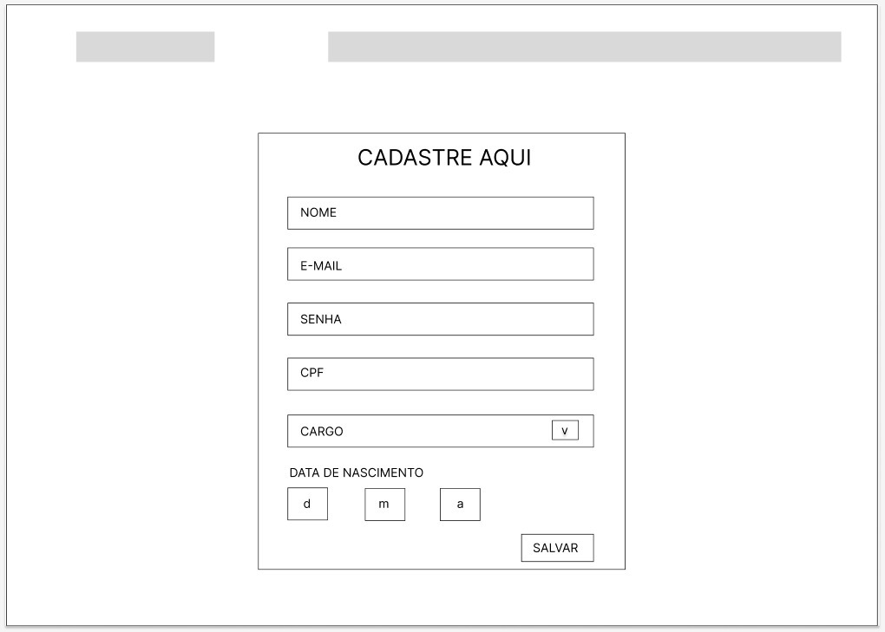
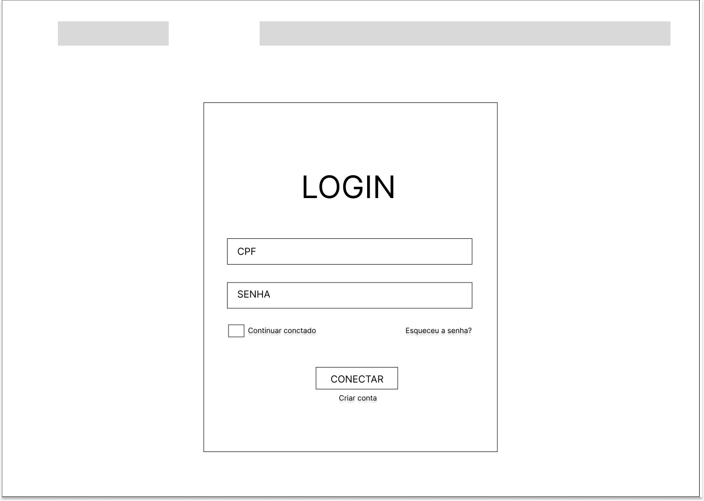
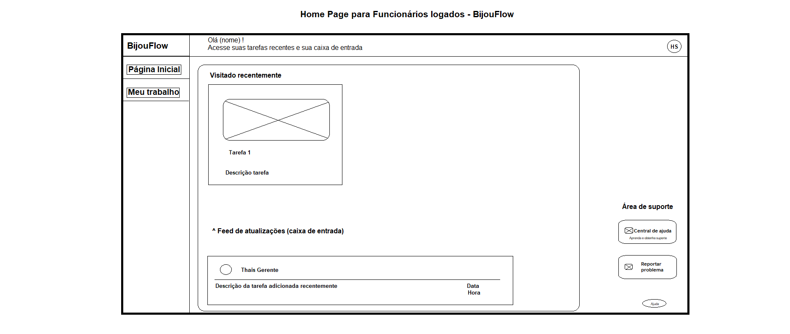
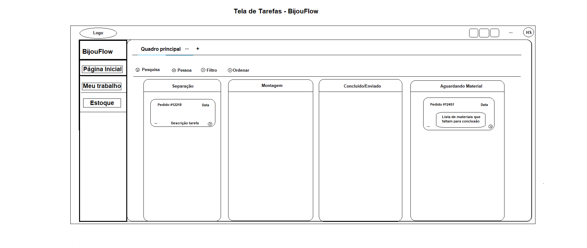
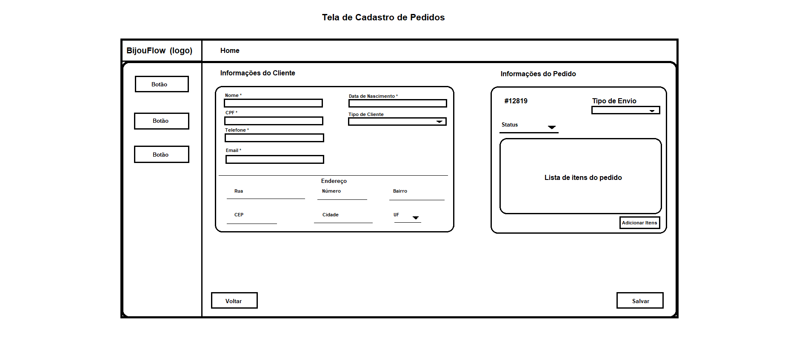
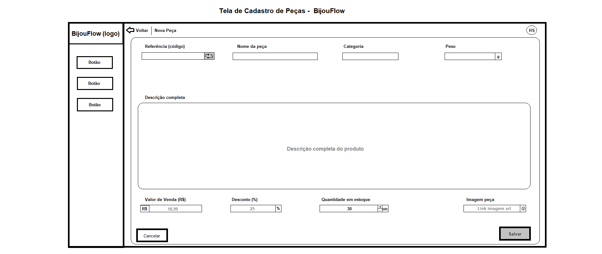
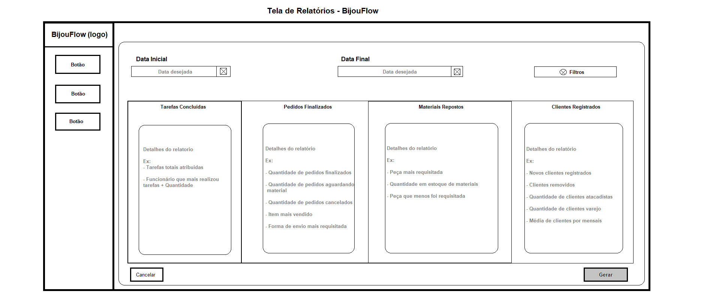

## 4. Projeto da Solução

Pré-requisitos: <a href="03-Modelagem do Processo de Negocio.md"> Modelagem do Processo de Negocio</a>

## 4.1. Arquitetura da solução

O BijouFlow é uma solução integrada para gestão de pedidos e produção da LuxeBijoux, composta por 4 módulos principais que se comunicam para automatizar processos manuais, garantir rastreabilidade e melhorar a eficiência operacional.

## Módulos e Tecnologias

**Módulo	Tecnologias	Função Principal**

-> Frontend Web	: React.js, Bootstrap	Interface para clientes (rastreio de pedidos) e gerentes (dashboard de produção)

-> Backend	ASP.NET Core (C#) : REST API	Lógica de negócio, integrações e processamento de dados

-> Banco de Dados	MySQL	: Armazenamento de pedidos, tarefas, estoque e histórico

 Inclua um diagrama da solução e descreva os módulos e as tecnologias
 que fazem parte da solução. Discorra sobre o diagrama.
 
 **Exemplo do diagrama de Arquitetura**:
 
 
 

### 4.2. Protótipos de telas

O sistema BijouFlow para a resolução de todos os problemas que foram encontrados na empresa LuxeBijoux, foi pensado os seguintes Wireframes iniciais para ser desenvolvido e posteriormente implementados para resolução dos problemas.

*Tela de cadastro*

*Tela de login*

*Home page funcionário logado*

*Tela de tarefas*

*Tela de cadastro de pedidos*

*Tela de cadastro de peças*

 *Tela de relatórios*

## Diagrama de Classes

Diagrama de classes inicial do sistema BijouFlow.

## Modelo ER

O Modelo ER representa através de um diagrama como as entidades (coisas, objetos) se relacionam entre si na aplicação interativa.]

As referências abaixo irão auxiliá-lo na geração do artefato “Modelo ER”.

> - [Como fazer um diagrama entidade relacionamento | Lucidchart](https://www.lucidchart.com/pages/pt/como-fazer-um-diagrama-entidade-relacionamento)

### 4.3. Modelo de dados

O desenvolvimento da solução proposta requer a existência de bases de dados que permitam efetuar os cadastros de dados e controles associados aos processos identificados, assim como recuperações.
Utilizando a notação do DER (Diagrama Entidade e Relacionamento), elaborem um modelo, na ferramenta visual indicada na disciplina, que contemple todas as entidades e atributos associados às atividades dos processos identificados. Deve ser gerado um único DER que suporte todos os processos escolhidos, visando, assim, uma base de dados integrada. O modelo deve contemplar, também, o controle de acesso de usuários (partes interessadas dos processos) de acordo com os papéis definidos nos modelos do processo de negócio.
_Apresente o modelo de dados por meio de um modelo relacional que contemple todos os conceitos e atributos apresentados na modelagem dos processos._

#### 4.3.1 Modelo ER

O Modelo ER representa através de um diagrama como as entidades (coisas, objetos) se relacionam entre si na aplicação interativa.]

#### 4.3.2 Esquema Relacional

O Esquema Relacional corresponde à representação dos dados em tabelas juntamente com as restrições de integridade e chave primária.
 
As referências abaixo irão auxiliá-lo na geração do artefato “Esquema Relacional”.

> - [Criando um modelo relacional - Documentação da IBM](https://www.ibm.com/docs/pt-br/cognos-analytics/10.2.2?topic=designer-creating-relational-model)

---

#### 4.3.3 Modelo Físico

Script pra criação da tabela do banco de dados

<code>

protected override void Up(MigrationBuilder migrationBuilder)
{
    migrationBuilder.AlterDatabase()
        .Annotation("MySql:CharSet", "utf8mb4");

    migrationBuilder.CreateTable(
        name: "Clientes",
        columns: table => new
        {
            ClienteId = table.Column<int>(type: "int", nullable: false)
                .Annotation("MySql:ValueGenerationStrategy", MySqlValueGenerationStrategy.IdentityColumn),
            Nome = table.Column<string>(type: "longtext", nullable: false)
                .Annotation("MySql:CharSet", "utf8mb4"),
            Cpf = table.Column<string>(type: "varchar(14)", maxLength: 14, nullable: false)
                .Annotation("MySql:CharSet", "utf8mb4"),
            Telefone = table.Column<string>(type: "longtext", nullable: true)
                .Annotation("MySql:CharSet", "utf8mb4"),
            Logradouro = table.Column<string>(type: "longtext", nullable: true)
                .Annotation("MySql:CharSet", "utf8mb4"),
            Numero = table.Column<string>(type: "longtext", nullable: true)
                .Annotation("MySql:CharSet", "utf8mb4"),
            Bairro = table.Column<string>(type: "longtext", nullable: true)
                .Annotation("MySql:CharSet", "utf8mb4"),
            Cidade = table.Column<string>(type: "longtext", nullable: true)
                .Annotation("MySql:CharSet", "utf8mb4"),
            Estado = table.Column<int>(type: "int", nullable: true),
            Cep = table.Column<string>(type: "longtext", nullable: true)
                .Annotation("MySql:CharSet", "utf8mb4"),
            DataCadastro = table.Column<DateTime>(type: "datetime(6)", nullable: false),
            DataUpdate = table.Column<DateTime>(type: "datetime(6)", nullable: false)
        },
        constraints: table =>
        {
            table.PrimaryKey("PK_Clientes", x => x.ClienteId);
        })
        .Annotation("MySql:CharSet", "utf8mb4");

    migrationBuilder.CreateTable(
        name: "Estoque",
        columns: table => new
        {
            EstoqueId = table.Column<int>(type: "int", nullable: false)
                .Annotation("MySql:ValueGenerationStrategy", MySqlValueGenerationStrategy.IdentityColumn),
            Nome = table.Column<string>(type: "longtext", nullable: false)
                .Annotation("MySql:CharSet", "utf8mb4"),
            DataUpdate = table.Column<DateTime>(type: "datetime(6)", nullable: false)
        },
        constraints: table =>
        {
            table.PrimaryKey("PK_Estoque", x => x.EstoqueId);
        })
        .Annotation("MySql:CharSet", "utf8mb4");

    migrationBuilder.CreateTable(
        name: "Funcionarios",
        columns: table => new
        {
            FuncionarioId = table.Column<int>(type: "int", nullable: false)
                .Annotation("MySql:ValueGenerationStrategy", MySqlValueGenerationStrategy.IdentityColumn),
            Nome = table.Column<string>(type: "longtext", nullable: false)
                .Annotation("MySql:CharSet", "utf8mb4"),
            Idade = table.Column<int>(type: "int", nullable: false),
            Email = table.Column<string>(type: "longtext", nullable: true)
                .Annotation("MySql:CharSet", "utf8mb4"),
            Telefone = table.Column<string>(type: "longtext", nullable: true)
                .Annotation("MySql:CharSet", "utf8mb4"),
            Cargo = table.Column<string>(type: "longtext", nullable: false)
                .Annotation("MySql:CharSet", "utf8mb4"),
            DataCadastro = table.Column<DateTime>(type: "datetime(6)", nullable: false),
            DataUpdate = table.Column<DateTime>(type: "datetime(6)", nullable: false)
        },
        constraints: table =>
        {
            table.PrimaryKey("PK_Funcionarios", x => x.FuncionarioId);
        })
        .Annotation("MySql:CharSet", "utf8mb4");

    migrationBuilder.CreateTable(
        name: "Pedidos",
        columns: table => new
        {
            PedidoId = table.Column<int>(type: "int", nullable: false)
                .Annotation("MySql:ValueGenerationStrategy", MySqlValueGenerationStrategy.IdentityColumn),
            NumeroPedido = table.Column<int>(type: "int", nullable: false),
            DataCadastro = table.Column<DateTime>(type: "datetime(6)", nullable: false),
            DataFinal = table.Column<DateTime>(type: "datetime(6)", nullable: false)
        },
        constraints: table =>
        {
            table.PrimaryKey("PK_Pedidos", x => x.PedidoId);
        })
        .Annotation("MySql:CharSet", "utf8mb4");

    migrationBuilder.CreateTable(
        name: "Pecas",
        columns: table => new
        {
            PecaId = table.Column<int>(type: "int", nullable: false)
                .Annotation("MySql:ValueGenerationStrategy", MySqlValueGenerationStrategy.IdentityColumn),
            EstoqueId = table.Column<int>(type: "int", nullable: false),
            Nome = table.Column<string>(type: "longtext", nullable: true)
                .Annotation("MySql:CharSet", "utf8mb4"),
            Preco = table.Column<decimal>(type: "decimal(65,30)", nullable: false),
            DescontoPorcentagem = table.Column<decimal>(type: "decimal(65,30)", nullable: false),
            QuantidadeDisponivel = table.Column<int>(type: "int", nullable: false),
            Imagem = table.Column<string>(type: "varchar(100)", maxLength: 100, nullable: true)
                .Annotation("MySql:CharSet", "utf8mb4"),
            Descricao = table.Column<string>(type: "varchar(200)", maxLength: 200, nullable: true)
                .Annotation("MySql:CharSet", "utf8mb4"),
            DataCadastro = table.Column<DateTime>(type: "datetime(6)", nullable: false),
            DataUpdate = table.Column<DateTime>(type: "datetime(6)", nullable: false)
        },
        constraints: table =>
        {
            table.PrimaryKey("PK_Pecas", x => x.PecaId);
            table.ForeignKey(
                name: "FK_Pecas_Estoque_EstoqueId",
                column: x => x.EstoqueId,
                principalTable: "Estoque",
                principalColumn: "EstoqueId",
                onDelete: ReferentialAction.Cascade);
        })
        .Annotation("MySql:CharSet", "utf8mb4");

    migrationBuilder.CreateTable(
        name: "Tarefas",
        columns: table => new
        {
            TarefaId = table.Column<int>(type: "int", nullable: false)
                .Annotation("MySql:ValueGenerationStrategy", MySqlValueGenerationStrategy.IdentityColumn),
            Status = table.Column<string>(type: "longtext", nullable: false)
                .Annotation("MySql:CharSet", "utf8mb4"),
            Descricao = table.Column<string>(type: "longtext", nullable: false)
                .Annotation("MySql:CharSet", "utf8mb4"),
            DataAtribuicao = table.Column<DateTime>(type: "datetime(6)", nullable: false),
            FuncionarioId = table.Column<int>(type: "int", nullable: false)
        },
        constraints: table =>
        {
            table.PrimaryKey("PK_Tarefas", x => x.TarefaId);
            table.ForeignKey(
                name: "FK_Tarefas_Funcionarios_FuncionarioId",
                column: x => x.FuncionarioId,
                principalTable: "Funcionarios",
                principalColumn: "FuncionarioId",
                onDelete: ReferentialAction.Restrict);
        })
        .Annotation("MySql:CharSet", "utf8mb4");

    migrationBuilder.CreateTable(
        name: "PedidoPeca",
        columns: table => new
        {
            PedidoId = table.Column<int>(type: "int", nullable: false),
            PecaId = table.Column<int>(type: "int", nullable: false),
            Quantidade = table.Column<int>(type: "int", nullable: false),
            PrecoUnitario = table.Column<decimal>(type: "decimal(65,30)", nullable: false)
        },
        constraints: table =>
        {
            table.PrimaryKey("PK_PedidoPeca", x => new { x.PedidoId, x.PecaId });
            table.ForeignKey(
                name: "FK_PedidoPeca_Pecas_PecaId",
                column: x => x.PecaId,
                principalTable: "Pecas",
                principalColumn: "PecaId",
                onDelete: ReferentialAction.Cascade);
            table.ForeignKey(
                name: "FK_PedidoPeca_Pedidos_PedidoId",
                column: x => x.PedidoId,
                principalTable: "Pedidos",
                principalColumn: "PedidoId",
                onDelete: ReferentialAction.Cascade);
        })
        .Annotation("MySql:CharSet", "utf8mb4");

    migrationBuilder.CreateIndex(
        name: "IX_Pecas_EstoqueId",
        table: "Pecas",
        column: "EstoqueId");

    migrationBuilder.CreateIndex(
        name: "IX_PedidoPeca_PecaId",
        table: "PedidoPeca",
        column: "PecaId");

    migrationBuilder.CreateIndex(
        name: "IX_Tarefas_FuncionarioId",
        table: "Tarefas",
        column: "FuncionarioId");
}

/// <inheritdoc />
protected override void Down(MigrationBuilder migrationBuilder)
{
    migrationBuilder.DropTable(
        name: "Clientes");

    migrationBuilder.DropTable(
        name: "PedidoPeca");

    migrationBuilder.DropTable(
        name: "Tarefas");

    migrationBuilder.DropTable(
        name: "Pecas");

    migrationBuilder.DropTable(
        name: "Pedidos");

    migrationBuilder.DropTable(
        name: "Funcionarios");

    migrationBuilder.DropTable(
        name: "Estoque");
}
}
</code>

### 4.4. Tecnologias

_Descreva qual(is) tecnologias você vai usar para resolver o seu problema, ou seja, implementar a sua solução. Liste todas as tecnologias envolvidas, linguagens a serem utilizadas, serviços web, frameworks, bibliotecas, IDEs de desenvolvimento, e ferramentas._

Apresente também uma figura explicando como as tecnologias estão relacionadas ou como uma interação do usuário com o sistema vai ser conduzida, por onde ela passa até retornar uma resposta ao usuário.

| **Dimensão**   | **Tecnologia**  |
| ---            | ---             |
| SGBD           | MySQL           |
| Front end      | HTML+CSS+JS     |
| Back end       | ASP.Net Core    |
| Deploy         | Github Pages    |

