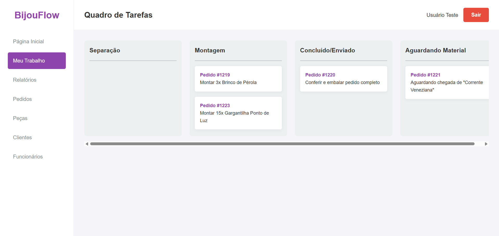

# 6. Interface do Sistema

_Visão geral da interação do usuário com o sistema, por meio das telas desenvolvidas para o projeto BijouFlow._

## 6.1. Telas de Autenticação

Estas são as telas iniciais para acesso e registro no sistema, garantindo que apenas usuários autorizados possam interagir com as funcionalidades de gestão.

### 6.1.1. Tela de Login

Permite que um funcionário ou gerente insira suas credenciais (e-mail e senha) para acessar o painel de controle do sistema. A tela oferece opções para "Continuar conectado" e um link para criar uma nova conta.

### 6.2. Tela de Cadastro

Nesta tela, um novo funcionário pode ser cadastrado no sistema. São solicitadas informações como nome, e-mail, senha, CPF e o cargo que irá ocupar, essencial para a atribuição de tarefas.

## 6.3. Telas do Painel de Controle (Dashboard)

Após a autenticação, o usuário é direcionado para o painel principal, que possui uma navegação lateral e uma área de conteúdo dinâmica, adaptada às suas permissões e tarefas.

### 6.3. Página Inicial

Esta é a tela de boas-vindas para usuários logados. Ela apresenta um resumo das atividades recentes, como tarefas visitadas, e um feed de atualizações da equipe. Também oferece acesso rápido à área de suporte.

### 6.4. Tela de Tarefas (Meu Trabalho)

Esta tela utiliza um quadro no estilo Kanban para organizar o fluxo de produção. As tarefas, associadas a pedidos, são movidas entre as colunas "Separação", "Montagem", "Concluído/Enviado" e "Aguardando Material", proporcionando uma visão clara do progresso de cada pedido.

### 6.5. Tela de Relatórios

A tela de relatórios permite ao gerente filtrar dados por um período específico para gerar métricas de desempenho. Os resultados são exibidos em cards que resumem informações sobre tarefas, pedidos, materiais e clientes, auxiliando na tomada de decisões estratégicas.

### 6.6. Tela de Cadastro de Pedidos

Interface dedicada ao registro de novos pedidos. Ela é dividida em "Informações do Cliente" e "Informações do Pedido", permitindo a associação de um cliente a um novo pedido, a definição do tipo de envio, status e a adição de itens.

